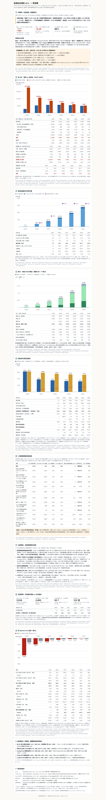

[智譜 回報] Z5｜完成｜2026-10-08

> **已被 r2 取代**：獨立查核後的修正（Z5b V1–V9）改變了結論與數字，見 `docs/reports/20261008_v0.1-r2_查核修正.md`；本檔保留 Z5 當時的內容。

- 分支 `claude/zhipu-v0.1`（PR #24）；本段 commit：9c60ffa（HTML、dist、test_html、截圖）、e391320（命題與驅動對照表）、ebba5a2（交接檔、README、CHANGELOG）、本報告 commit（最新 SHA 見 PR 留言）。
- 成品：`zhipu/dist/20261008_智譜收支模型_v0_1.html`（164,133 bytes，單一檔案、離線雙擊可開）、`zhipu/dist/20261008_智譜收支模型_v0_1.xlsx`（354,239 bytes，＝`model/20261008_Zhipu_v0.1.xlsx` 位元組相同）。
- **Excel 未改**（Z5 只動 tools／tests／dist／docs；`model/`、`builder/`、`data/` 與 Z4 相同）。
- GitHub Actions 因帳號付款問題不會執行；驗收以本地為準。

## 結論先行
HTML 一頁摘要把 v0.1 的結論寫成：**智譜在轉正邊緣**。
- 讀法一（每 VR 等值 GW，命題定義、與 OpenAI 同口徑）：2030 差額 −231 RMB 億（−$3.4B），覆蓋率 96%。
- 讀法二（每實體 GW）：2030 差額 −$0.19B。白話：國產／Hopper 機隊換成 VR200 等值只值約 0.056 倍，所以讀法一的每 GW 數字被放大。
- 四個翻轉點都緊貼基準：每 GW 價格年降 ≥10.9%、研發占比 ≤0.688、Coding Plan 額度使用率 ≥0.163、2H26 任務成長 ≥+285%。本頁在每個翻轉值用 LibreOffice 重算 Excel，2030 差額都顯示為 0。
- 命題 2：基準 2030 前不需外部資金，但「主要風險」一節並列五項與實際觀察的落差。其中 2026-07 配售款動用速度是模型的 12.2 倍；1 GW 資料中心情境下 2030 累計需要 879 億、2026 起就出現缺口。這兩項顯示命題 2 可能被高估。

## 表 1　工作單逐項
| 項 | 完成 | 位置 | 摘要 |
|---|---|---|---|
| 1 命題與驅動對照表 | 是 | `docs/plan/20261008_Zhipu_命題與驅動對照表.md` | 格式同 OpenAI 版：一句話命題、主因果鏈、各頁輸入／衍生量／因果方向／是否繼承 Tokenomics、繼承 vs 公司專屬、與 OpenAI 模型的關係、三個關鍵驅動（含翻轉點） |
| 2 HTML 一頁摘要 | 是 | `dist/20261008_智譜收支模型_v0_1.html` | 11 節、686 個數字、19 個情境；只讀 LibreOffice 重算後的 Excel；每個數字游標停留顯示 Excel 位置（頁＋列 ID＋格＋具名範圍＋年度＋情境），每節末列 Excel 位置 |
| 2 與 OpenAI v0.6 並排（美元） | 是 | HTML ⑨ | 每 VR 等值 GW 營收、全成本、差額、覆蓋率、供給 VR 等值 GW、自由現金流、已到位融資、累計外部資金需求、年底現金；另列智譜每實體 GW 差額；SVG 長條圖 |
| 2 市值對照 | 是 | HTML ⑧ | 市值 2,916、EV 2,493、市值隱含營收 62.7（31.3–125.4）、正向營收 ÷ 隱含營收（2027 1.28 → 2030 4.44）、智譜自身 EV／營收 131 倍、MiniMax 39.8 倍 |
| 2 版面風格與 OpenAI 版一致 | 是 | 同一套 CSS、深淺色、手機版 | 截圖見下 |
| 2 測試：數字與 Excel 一致、無外部 URL | 是 | `tests/test_html.py` | 6 項全過 |
| 3 dist xlsx | 是 | `dist/20261008_智譜收支模型_v0_1.xlsx` | test 驗證 SHA-256＝model |
| 3 交接檔 | 是 | `docs/handoff/Zhipu_handoff.md` | v0.1 完成狀態、未解問題 7 項、v0.2 建議 6 項 |
| 3 根目錄 README 智譜列 | 是 | `README.md` | 「v0.1」 |
| 4 驗收、報告、PR 留言、轉 ready | 是 | 本檔 | 見下 |
| chat 補充 1：開頭兩種讀法＋0.056 白話＋「在轉正邊緣」＋四個翻轉點 | 是 | HTML ① | 翻轉值取自敏感度 JSON，在該值重算 Excel 驗證差額≈0 |
| chat 補充 2：主要風險／與實際觀察的落差（五項並列，附 Excel 位置或 SRC ID） | 是 | HTML ⑦ | ①配售款動用 HK$109.5 億（SRC_ZP_540）＝模型 12.2 倍（Funding F52–F54）②1 GW（SRC_ZP_458；Compute G130、G104；INP_112）③預付算力服務費 1.16 → 12.44 億（SRC_ZP_220／219）④ARR 差距 −50%（Revenue R70–R72）⑤η 9.5（Compute G94）；加列 Excel 已有的 1 GW 情境與可轉債轉股情境關鍵數字 |
| chat 補充 3：市值對照 | 是 | HTML ⑧ | 見上 |
| chat 補充 4：與 OpenAI v0.6 並排（美元） | 是 | HTML ⑨ | 見上 |

## HTML 各節標題
1. ① 命題與一句話結論（兩種讀法）：結論、4 個 KPI、兩種讀法的白話、四個翻轉點
2. ② 每 GW：營收 vs 全成本（2025–2030）：每 VR 等值 GW、每實體 GW、絕對金額三張表＋圖
3. ③ 營收結構與分析師共識
4. ④ 算力：供給 GW 的用途（實體 GW，IT 電力）
5. ⑤ 現金與外部資金需求
6. ⑥ 三個關鍵驅動與敏感度（13 個情境）
7. ⑦ 主要風險／與實際觀察的落差
8. ⑧ 市值對照：市值隱含營收 vs 正向營收
9. ⑨ 與 OpenAI v0.6 並排（美元）
10. ⑩ 最該審的 5 項預設（翻轉點緊貼基準者）
11. ⑪ 資料與版本

## 關鍵數字（HTML 顯示值＝Excel）
| 項目 | 值 | Excel 位置 |
|---|---|---|
| 2030 每 VR 等值 GW 差額 | −231 RMB 億（−$3.4B）；OpenAI −$10.1B | Cost K48、K57；OAI_Link |
| 2030 每實體 GW 差額 | −$0.19B（−13.0 RMB 億） | Cost K73、K70 |
| 機隊 VR 等值係數 2030 | 0.056 | Cost K67 |
| 覆蓋率 2025 → 2030 | 16% → 96% | Cost K51 |
| 累計外部資金需求 2030 | 0（首次缺口年：期間內無） | Funding F30、F36 |
| 2030 年底現金 | 321.2（轉股 522.6） | Funding F29、F43 |
| 翻轉點 | INP_100 −10.9%、INP_110 0.688、INP_060 0.163、INP_038 +285%（各情境 2030 差額 0） | Inputs；Cost K48（情境 flip_*） |
| 1 GW 資料中心情境 | 2027 差額 −109,323；2030 差額 +4,844；累計外部資金需求 879；首次缺口年 2026；2030 年底現金 510 | 情境 dc1gw（INP_112＝1） |
| 配售款動用 | HK$109.5 億（RMB 94.1 億）＝模型同期 7.7 億的 12.2 倍 | SRC_ZP_540；Funding F52–F54 |
| 市值／EV／隱含營收 | 2,916／2,493／62.7（31.3–125.4） | Reverse X41、X44、X53–X55 |

## 預期變動 vs 實際變動
- 預期：新增 HTML、dist、對照表；交接檔、README 更新；Excel 不變。實際：全部達成，Excel 與 Z4 位元組相同（dist xlsx 的 SHA-256＝model）。
- 範圍外變動：0（只改 `zhipu/` 與根目錄 README 的智譜一列；未動 openai／nebius／oracle／anthropic、Tokenomics、main）。

## 已套用的預設（Z5）
| # | 問題 | 採用的預設 | 替代選項 | 對結果的影響方向 |
|---|---|---|---|---|
| 1 | 翻轉點的數值來源（Excel 內沒有翻轉點儲存格） | 取自 `docs/reports/20261008_v0.1_敏感度.json`，即 `tools/sensitivity_z4.py` 以 engine 執行 Excel 二分搜尋的結果。HTML 把該值寫入 Inputs 後以 LibreOffice 重算，顯示翻轉值本身（讀回 Inputs 格）與該情境 2030 差額（＝0）。test_html 驗證 \|差額\|<1 | 在 Excel 內建翻轉點列（需改 Excel，屬 v0.2） | 無數值影響；翻轉值仍可追溯到 Excel |
| 2 | 港幣百萬顯示為「億」（SRC_ZP_540 單位 HKD 百萬） | 格式化時 ÷100 顯示（fmt `hm2y`，只改顯示單位，test 用同一規則） | 顯示原值「10,954.8 百萬」 | 無 |
| 3 | 敏感度情境的值 | 一律取 Inputs 低／高欄（與 `sensitivity_z4.yaml` 的字面值相同）；部分融資子集合情境把 SRC_ZP 融資淨額設 0 | 字面值 | 無（數值與 v0.1 報告 ③ 一致） |
| 4 | 敏感度表的「首次轉正年」 | 不列（Excel 沒有此儲存格，HTML 不計算）；改列 2030 差額、覆蓋率、供給 GW、累計外部資金需求、首次缺口年（Funding F36）、年底現金 | 在 Excel 新增轉正年摘要列 | 無；首次轉正年見 v0.1 報告 ③ |
| 5 | ARR 對照口徑 | 主要風險一節用 MaaS ARR（Revenue R70–R72，−50%）；年末 ARR 指引（Reverse X02–X04，−69%）放在營收一節 | 只列全業務 ARR（R73–R75，−49%） | 無 |
| 6 | 1 GW 資料中心 | 維持情境（INP_112），HTML 並列該情境關鍵數字；不改基準（Excel 不動） | 改為基準 | 若改基準：2030 累計外部資金需求 0 → 879 億 |
| 7 | 版面 | 沿用 OpenAI v0.6 的 CSS 與元件，節數由 8 增為 11（新增主要風險、市值對照、OpenAI 並排） | — | 無 |
| 8 | 截圖 | 桌面 1280／手機 390 × 淺色／深色共 4 張，整頁（約 12.7 MB，同 OpenAI 做法） | 只截首屏 | 無 |

## 驗收
- `python3 tools/build_html.py`：基準＋18 情境各以 LibreOffice 重算（約 80 秒），CHK_Errors＝0，HTML 686 個數字。
- `python3 -m pytest tests/test_html.py tests/parity/test_builder.py -q -p no:warnings`：**19 passed**（test_html 6、test_builder 13；20 秒）。
  - test_html：①每個 data-ref 數字（含 SVG 標籤）＝engine（pycel）在同一情境重算的 Excel 值（顯示文字與 data-v）②19 個情境都有呈現 ③無外部引用（http、//cdn、@import、url(、script、link、img、iframe、外部 src／href）④必要各節與 SRC ID 都在 ⑤dist xlsx＝model、dist 只有一份 HTML ⑥定性主張（每年差額皆負、覆蓋率逐年上升、2030 前不需外部資金、四個翻轉點差額≈0、CHK_Errors＝0）。
- **parity 全套未重跑**：Z4 已通過（106 passed，26 分 36 秒；42 情境、全部公式格與 LibreOffice 一致），Z5 未改 Excel、builder、data。
- 截圖檢查（`tools/screenshot_html.py`）：4 種版面都沒有水平捲動（scrollWidth＝視窗寬），沒有任何外部網路請求。

## 版面截圖
- 桌面淺色：`docs/reports/img/20261008_v0.1_成品_desktop_light.png`
- 桌面深色：`docs/reports/img/20261008_v0.1_成品_desktop_dark.png`
- 手機淺色：`docs/reports/img/20261008_v0.1_成品_mobile_light.png`
- 手機深色：`docs/reports/img/20261008_v0.1_成品_mobile_dark.png`

## 未解問題（同交接檔第 4 節）
1. 2026-07 配售款 7–8 月動用速度是模型的 12.2 倍。支出可能被低估，命題 2 可能不成立。
2. 公司稱已落地 1 GW 級國產資料中心，口徑未明；模型基準 2H26 只有 0.14 GW。
3. 預付算力服務費 1.16 → 12.44 億，模型未納入；1H26 現金對帳差 −14.88 億。
4. 模型 2H26 年化雲端營收比 MaaS ARR 低 50%。
5. η 仍約 9.5，殘差來源未證實。
6. 現金流量表、借款條件、算力採購承諾找不到。
7. Andy 尚未審查 101 項預設。

## 建議後續（v0.2）
見交接檔第 5 節。最優先：取得年報與中期報告全文，拆解配售款動用與預付算力服務費；確認後決定 1 GW 資料中心是否改為基準。也可以在 Excel 內建翻轉點與首次轉正年的摘要列，讓 HTML 不必依賴敏感度 JSON。
